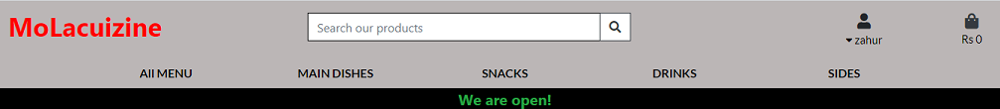

# **MoLacuizine**


## TABLE OF CONTENT 
* [Introduction](#introduction)    
* [UX](#ux)
    * [UX design work overview](#ux-design-work-overview)
    * [Colour scheme](#colour-scheme)
    * [Typography](#typography)
* [Development cycle](#development-cycle)
* [Features](#features)
    * [Navbar](#navbar)
    * [Modals](#modals)
    * [search bar and pagination](#search-bar-and-pagination) 
    * [Profile page](#profile-page)
    * [Control center](#control-center)
    * [Side navigation](#side-navigation)
    * [Sold feature](#sold-feature)
    * [Flash messages](#flash-messages)
    * [Footer](#footer)
* [Technologies used](#technologies-used)
* [Images](#images)
* [Data schema](#data-schema)
    * [CRUD operations](#crud-operations)
    * [Setting up mongodb database](#setting-up-mongodb-database)
    * [CRUD authorisation and security features](#crud-authorisation-and-security-features)    
* [Testing](#testing)
    * [UX testing](#ux-testing)
    * [validators](#validators)
    * [Chrome DevTools](#chrome-devtools)    
    * [Site testing](#site-testing)
    * [Responsive design](#responsive-design)
    * [Browser compatibility](#browser-compatibility)
    * [Button and link testing](#button-and-link-testing) 
    * [Crud operation testing](#crud-operation-testing)    
    * [Issues encountered during development](#issues-encountered-during-development)

* [Deployment](#deployment)
* [Future improvements](#future-improvements)
* [Credits](#credits)

## INTRODUCTION 

This project is a online food ordering and delivery service. The menu covers a wide range of popular mauritian 
cuisine whereby a customer can add food items to a basket and then make payments online using stripe service.

The site name 'MoLacuizine' is mauritian for 'My Kitchen' and covers a wide range of item from main dishes to 
sides.

The site would also permit the user to add and modify profile information to be used at checkout and also to have a list
order history for reference. 

The site uses the Django framework.

The live site can be found [here](http://mo-lacuizine.herokuapp.com/).

## UX 

By visiting this site as a user I want to:
* have a user friendly registration/login process in order to use the site.
* be provided with full details of each product.
* be able to add items to a basket so I can view all items I have selected together with the associated cost.
* be able to modify items added to my basket so as to make any required changes.
* be able to add and update my user profile so to make any changes if required.
* have a user friendly checkout process.
* be provided with estimated delivery time for ordered items to be able to know when I expect my food items to arrive.
* be provided with a list of previously ordered items for me to track my order history.
* be advised that checkout was successful to ensure order was processed.
* be informed of the online open/close status for ordering.

By using this site as the site owner:

* be able to add, update and delete items for store management purposes.
* be able to open and close the online site for control  purposes.

### UX design work overview

The following provides an overview of the site layout and logic behind design choices.

A wireframe was constructed using balsamique wireframes. It can be found [here](static/doc/wireframe.pdf).

The site consisted of a main landing page which contained a fixed top navbar from which the user could access 
food items categories,accounts and basket. This was done so as to give a general overview to the user before showing any items.
The main landing page would also show the main information about the site such open-status and delivery zones.

The site implemented several features to make registration, login, checkout, adding items and profiles as user friendly and 
intuitive as possible which are described below. 

The django messages system was included so as to enable the user obtain feedback on whether actions had been completed.

A search bar was then provided in the top navbar for conveienience to provide an easy way for searching for items.

The items product page provided an overview of the item which could be purchased with the main information on the product. 
Each item could be clicked on to provide further detail on the product. This was done to make the product listing page less bulky 
and more user friendly.

From the product detail page items could be added to a basket to be viewed later.

The bag view consisted of a convenient place to view all items added to basket with their associated cost. Items could be 
modified if required in this view.

The profile page consisted of a form which the user could prefill which could be used at checkout so as to enable a 
smoother checkout process.

The store management page allowed a convenient place to upload items and update shop online status.

All features are described in detail [below](#features).

### Colour Scheme 

Several colour schemes were tested and the following palette was finally adopted since it was thought to fit into the overall site theme.


All button were also designed to have an identical colour scheme for easy identification.

### Typography

Font were obtained from [google font](https://fonts.google.com/) and consisted of the following:
- 'Lato'

## DEVELOPMENT CYCLE

The main development cycle is listed below:

1. Site design work making use of sketch pad and balsamique.
2. Database design.
3. Alluath initial setup.
4. Home app creation and coding (main landing page).
5. Product app coding (item listing pages including item details, search bar).
6. Bag app creatoin and coding (bag page).
7. Coding add to bag view.
8. Coding of context.py (bag contents).
9. Coding of bag view.
10. Coding of edit and update bag features.
11. Pagination coding of item listing page.
12. Profile app creation and coding (profile page).
13. Checkout app reation and coding(checkout page without stripe).
14. Coding for updating of profile page details.
15. Coding for adding order history to profile page.
16. Coding for store management page (adding/updating/deleteing products).
17. Store status coding.
16. Deployment to heroku.
17. Coding for stripe checkout.
18. Coding for google distance matrix.
19. Project review.
20. Minor modifications addressed from step 19.
21. Addition of spice index to site with neccessary updating of installed apps.

## FEATURES

This section gives details of the features included and their function.

### Navbar

A standard navbar was used which was obtained from materialize to allow navigation between the
different pages and was made to collapse on medium and down devices.



### Modals

During site design it was decided to use modals for registration and login instead of having separate pages. This was 
thought to improve the overall site experience since login could be done from the main page. Modals could be 
interchanged with a click here button and would reopen if data submitted did not meet the login/registration criteria. 


A third modal was also used for the about section.

### Search bar and pagination

Search bar and pagination features were included in the site. These functions were not originally planned and were  
were included after mid project review since it was thought to be good practice for such a site where item quantity 
could be significant. The inclusion was thought to improve UX. The search criteria used were:
1. seller name
2. category
3. description

These criterion were suitable enough to narrow down the item list significantly whilst offering the user broad search requirements.


### Item cards

The item was displayed on cards and divided into two areas, one for item image and the other for item description.
All information on the item was located in one place for convenience and the image could be enlarged by clicking 
on them by making use of materialize media box.


The card also had a link to the profile page of the seller if the buyer wished to obtain further information. Edit and
delete item buttons were also included on the card to provide convenient place for the item owner to make modifications.

### Profile page

A user profile page was included which permitted the user to upload a profile pic and provide a description about themselves
so a buyer could obtain more details about the person. This feature was made to be optional.

This page also provided the profile user and buyer with and centralised page where all the profile users items would be listed in a 
convenient way. 

The items could be modified and deleted at will by the profile user instead of having to search for each individual item 
on the main page hence improving the user interface.


### Control center

A control center page was included for only for the admin. This page listed all registered users, items and categories for the admin
to have access to in one convenient place. This page was used for control purposes were all modifications could be made instead of having 
to search for each individual user and items. 


### Side navigation

A side navigation menu was added on large screen and higher devices. This permitted the user to scroll to items by
name and was added to improve user experience.


### Sold feature

The profile page also included a sold feature whereby the item could be listed as sold instead of deleting them and could be used
as a marketing tool indicating that the seller items were in demand.

Once the item sold feature was activated the item would be removed from items list on the main page.


### Flash messages

Flash messages were used whenever a create, update or delete operation was performed. This would provide confirmation 
to the user that the operation had been completed and the database had been updated.


### footer

A basic footer was provided with a link to wikipedia containing a list of art museums.

## TECHNOLOGIES USED

* HTML5
* css 
* javacript (ES6)
* python (v3.8.6)
* flask (v1.1.2) for the web framework
* mongodb to store data 
* Jquery to simplify DOM manipulation
* pylint, flake8 for python syntax
* official W3C validator to check HTML syntax
* css official validator(jigsaw) to check css syntax
* JSHint to check javacript syntax 
* Chrome developers tools for analysing scripts and debugging
* Materilize 1.0.0 for :
    1. page layout purposes and responsive design aspects
    2. Forms 
    3. Modals
    4. Scrollspy
    5. Materialized media box
    6. Navbar
    7. Footer
* balsamiq wireframes application to create the site design
* Chrome extension 'responsive viewer' to aid in responsive design 

## Images 

An important part of the website design process was the means by which the user would provide images to the site. 
From the onset it was decided to allow the user to upload images instead of the user providing a URL. This was thought to 
improve the overall site experience since it would be much more convenient for the user. 

A tutorial on how to upload images into mongodb database was sought and is located [here](https://www.youtube.com/watch?v=DsgAuceHha4)

Mongodb BSON documents allowed the storage of images and was capped at 16mb. This was thought to be sufficient for the
intended use. A helper text when uploading images was added stating a lower limit of 10mb. 

Images which were deleted had there corresponding fs.files and fs.chunks removed for house cleaning purposes since the database was 
of limited size.

## Data schema 

Mongodb was used for database storage since this type of non-relational database was well suited for storing user and
item details which contained information of different formats. Information could be displayed faster since a query doesn’t 
have to view several tables in order to deliver an answer, this was well suited for the items collections.

Also flexible schema offered by mongodb was thought to be advantageous in the likely event that new fields would need to be
added in the future. This was highlighted by the introduction of the sold feature into the items collection.

The main database contained 4 collections:

| Collections         |   Fields                                                           |
|:--------------------|:-------------------------------------------------------------------|
|User                 |  Username, Password, contact number, email                         |                                     |    
|Profile              |  Username, profile image, full name, profile description           |
|Items                |  Category, image, name, description, price, username, sold         |             
|Categories           |  Category name                                                     |            

The user collection was used for registration and login purposes. The contact number and email fields were
added to this collection instead of the items collection since it would only have to be entered once and would remain
constant for that user. This would also prevent the user from having to add contact info with each item upload and prevent 
duplicate contact info for the same user.

The username would be used as seller name.

The profile collection was used to provide additional information on the seller and was purposely given its own 
collection since it was an option and could be independently edited without affecting other collections. 

The items collections consisted of all the required information about the item being sold for a buyer to see. 

Categories collections consisted of seven main painting categories and was made to be independent.

The user, profile and items collections had a matching field of 'username' which was used as a common reference. This was
done to links documents where common information about a user needed to be displayed. One such page which made use of this 
reference was the profile page.


### CRUD operations

CRUD operations were essential for the running of the site and were provided for the following features:

| Feature             |   Create   |   Read    |  Update  |  Delete  |  Mongodb collection | 
|:--------------------|:-----------|:----------|:---------|:---------|:--------------------|
|User registration    |  ☑   |           |  ☑ |          | Users               |   
|User login           |            |  ☑  |          |          | Users               |
|User items           |  ☑   |  ☑  |  ☑ |  ☑ | Items               |             
|User Profile         |  ☑   |  ☑  |  ☑ |  ☑ | Profile             |            
|Item sold            |  ☑   |  ☑  |  ☑ |          | Items               |
|Category             |  ☑   |  ☑  |  ☑ |  ☑ | Category            |

The update operation for the registration feature was for the contact information fields only. 

### Setting up Mongodb database

1. On the designated cluster setup up the security database settings by adding a database user.


2. On the designated cluster click on collections.

    

3. Click on create database and then add database name collections.

    
    

### CRUD authorisation and security features

A user would have authorisation to update and delete any information uploaded by themselves except for the their username,
and password. 

No registered user would be able to apply CRUD operations for any other user. This was done by providing jinja template logic.

The admin would have authorisation to update and delete all uploaded user information present in the database.
This was done so as the admin could maintain control on what information was being displayed on the site. 

The control center was only accessible to the admin by using jinja template logic.

## TESTING 

This section provides details of testing performed during development. The following table highlights the different stages when testing were carried out:

| Test                | Stage Performed                                  | Tool used                                     |
|---------------------|:-------------------------------------------------|:----------------------------------------------|
|Syntax errors        |Once During mid development and on completion     |W3C validator, css validator(jigsaw), jshint   |
|Debugging            |During the whole project                          |Chrome Devtools                                |
|Responsive design    |During the whole project                          |Chrome Devtools and responsive viewer extension|
|Site testing         |As from when main site was completed              |By myself and relatives                        |
|Browser compatibility|On project completion                             |Manual testing on browsers                     |                    
|Button/link testing  |During development and project completion         |Manual testing                                 |

### UX testing

The goals set out in the UX section were accomplished as follows:

1. User goal: *be able to easily understand what the site is about in order to see if it is of interest to me*<br>
The site design was thought to achieve this goal and an about section was included to this effect.

2. User goal: *have a user friendly register/login process in order to start using the site*</br>
The site made use of easy to use straight forward registration and login modals which made the both processes very easy. 

3. User goal: *be able to upload my item information with ease in order for buyers to view them*</br>
This was achieved by using an add item form page which contained all the necessary information required for uploading in 
one easy to use form.

    

4. User goal: *be provided with an option to upload my personal information so potential buyers can see who I am*</br>
This was achieved by having using a profile page which is described [above](#profile-page).

5. User goal: *be able to edit and delete all uploaded information if any changes need to be made*</br>
This was achieved by using the CRUD functions detailed [above](#crud-operations).

6. User goal: *be able to tag an item as sold so as the buyers can see how in demand my works are*</br>
This was achieved by using the sold item feature detailed [above](#sold-feature).

7. Buyer goal: *have information about the item being sold in one place for convenience of use*</br>
This was achieved by using the items cards detailed [above](#item-cards).

8. Buyer goal: *have the ability to view items by search criteria in order to narrow down item list to specific requirements*</br>
This was achieved by using the search bar detailed [above](#search-bar-and-pagination).

9. Site owner: *be able to edit and delete any loaded information for content control purposes.*</br>
This was achieved by allowing full CRUD operations to the admin as detailed [above](#crud-authorisation).

10. Site owner: *have full access to all uploaded information in one convenient place for CRUD operations*</br>
This was achieved by using the [control center](#control-center) and tested by myself.

The above user goals were further tested by obtaining feedback from an artist. The feedback was positive all on aspects.

### Validators

Code syntax were checked for errors with the following validators:
* official W3C validator located [here](https://validator.w3.org/)
* css official validator(jigsaw) located [here](https://jigsaw.w3.org/css-validator/)
* JSHint located [here](https://jshint.com/)
* Pylint, flake8, PEP8 for python code validation

Errors were corrected and final test results are given below:

| Test                                 | Expected result                | Results            |                                 
|:-------------------------------------|:-------------------------------|:-------------------|
|W3C validator                         |No errors or warnings to show   |Passed              | 
|css official validator(jigsaw)        |No errors found                 |Passed              |                            
|JSHint located                        |Congratulations. No error found |Warnings present    |
|Python validator(pylint, Flake8, PEP8)|No errors                       |Errors present      |

For the W3C validator all errors due to jinja templates were filtered out.

The error 'Doctype must be declared first' was also ignored and was due to the use of base.html template.

The Jshint test results had the warning " 'let' is available in ES6 (use 'esversion: 6') or Mozilla JS extensions (use moz)." was due to
syntax used for defining variables.

### Chrome DevTools

Chrome DevTools were used extensively during development phase to assist in:
* page layout issues 
* checking errors
* debugging
* verifying correct output using console  

### Site testing

The site was tested by myself and once the main site was completed it was further tested by having an artist 
register and use the site with minimal prompting. The feedback obtained was positive.

### Responsive design

The site was viewed on different device sizes to check for correct responsive design. This was done using primarily
Chrome DevTools with different emulated devices(moto G4, iphone 6/7/8, ipad, ipad pro). The responsive viewer chrome 
extension was also used. Resolutions covered are as follows:

|Screen resolution| Device                        |
|:----------------|:------------------------------|
|1280 X 800       |large screen                   |
|1024 X 800       |medium screen                  |
|768 X 1024       |ipad                           |
|414 X 736        |iPhone 8 Plus, 7 Plus, 6S Plus |
|375 X 667        |iPhone 8, 7, 6S, 6             |
|414 X 896        |iPhone XR, XS Max              |
|375 X 812        |iPhone XS, X                   |
|412 X 846        |Galaxy S9 Plus, S8 Plus        |
|360 X 740        |Galaxy S9, Note 8, S8          |
|323 X 786        |Pixel 3, 3 XL                  |


A final check was done using the website http://ami.responsivedesign.is/. 

### Browser compatibility

The site was tested on Google Chrome, FireFox, Internet Explorer, Safari and Opera.

### Button and link testing

The following gives test results for button and link testing not related to CRUD operations.

|links/button                            |Expected result                                                           | Results |                                 
|:---------------------------------------|:-------------------------------------------------------------------------|:--------|
|Register                                |Register modal to open                                                    |Passed   |
|Submit (Register modal-correct data)    |Flash message "You have been registered"                                  |Passed   |                                           
|Submit (Register modal-incorrect data)  |Flash message error mesage and modal to reopen                            |Passed   |
|Submit (Login modal-correct data)       |Flash message "You have been logged in"                                   |Passed   |
|Submit (Login modal-incorrect data)     |Flash error message and modal to reopen                                   |Passed   |
|here text on modals                     |Login/Register Modals to switch over                                      |Passed   |
|Logout                                  |Flash message "You have been logged out"                                  |Passed   | 
|Home                                    |Home page to load                                                         |Passed   |
|About                                   |About Modal to open up                                                    |Passed   |
|Register (about modal)                  |About modal to close and register modal to open                           |Passed   |
|Artist for life logo                    |Main index html page to load                                              |Passed   |
|Control center                          |Control center html  page to load                                         |Passed   |
|Profile                                 |Profile html page to load                                                 |Passed   |
|Add item                                |Add item html form page to load                                           |Passed   |
|Edit item                               |Edit item html form page to load                                          |Passed   |
|Create profile                          |Add profile html form page to load                                        |Passed   |
|Edit profile                            |Edit profile html form page to load                                       |Passed   |
|Edit Contact details                    |Edit contact html form to load                                            |Passed   |
|Mark as sold                            |Sold banner text to appear on item and item to be removed from item list  |Passed   |
|Mark as available                       |Sold banner text to be removed from item and item to be added to item list|Passed   |
|Seller profile                          |Profile page to load for that user                                        |Passed   |
|chevron arrows                          |Loading of next or previous page                                          |Passed   |
|pagination numbers                      |Loading of selected page                                                  |Passed   |
|search button                           |Search page to load with relevant search results                          |Passed   |
|Reset search                            |Main item page to load                                                    |Passed   |
|Palette icon                            |Wikepedia page to open in separate page                                   |Passed   |
|click to call                           |Phone request to be made with correct number                              |Passed   |
|click to mail                           |Email request activated with correct email                                |Passed   |
|Provide non-existent url                |Loading of 404.html page                                                  |Passed   |

### Crud operation testing

The following table summarises CRUD operation testing

|Button            | Location              |Expected result                                                     | Results | Flash Alerts |                                 
|:-----------------|:----------------------|:-------------------------------------------------------------------|:--------|:-------------|
|Submit            | Registration modal    |user information to be added to users collection in mongodb         |Passed   |    &#9745;   | 
|Add item          | Add item form         |Item information to be added to items collection in mongodb         |Passed   |    &#9745;   |
|Add profile       | Add profile form      |Profile information to be added to profiles collection in mongodb   |Passed   |    &#9745;   |
|Confirm           | Edit item form        |Item information to be updated in items collection in mongodb       |Passed   |    &#9745;   |
|Confirm           | Edit profile form     |Item information to be updated in profiles collection in mongodb    |Passed   |    &#9745;   |
|Delete            | items main page       |Item information to be removed from items collectionsin mongodb     |Passed   |    &#9745;   |
|Delete            | Profile main page     |Item/profile to be removed from items/profile collection in mongodb |Passed   |    &#9745;   |
|confirm           | Edit contact form     |Contact details to be updated in users collection in mongodb        |Passed   |    &#9745;   |
|delete            | Control center        |Item/profile/category deleted in users collection in mongodb        |Passed   |    &#9745;   |
|Add category      | Control center page   |New category to be added to categories collection in mongodb        |Passed   |    &#9745;   |
|Confirm           | Edit category form    |Category to be updated in categories collection in mongodb          |Passed   |    &#9745;   |
|Mark as sold      | Profile html page     |Sold field to be updated to "true" in items collection              |Passed   |    &#9745;   |
|Mark as available | Profile html page     |Sold field to be updated to "false" in items collection             |Passed   |    &#9745;   |

During item deletion/editing it was checked to see that image data was removed/updated from fs.files and fs.chunks also.

A further test was performed whereby all items and profiles were deleted to check whether no data remained in fs.files and
fs.chunks. This test was successful.

### Issues Encountered during development

During testing phase the following issues were identified and corrected.

1. Pagination  and creating new views

2. Active link in pagination and using z-index-0.

3. Cusomising sign in form to include firstname and lastname

4. Adding placeholders to customised registration by using js.

5. Adding placeholder to profile form using javascript.

6. Adding customised upload image button using javascript

7. Deployment and creating fixtures to enable deployment

8. stripe publishable key errr

# DEPLOYMENT

Gitpod was used as an online IDE and then pushed to GITHUB. The Github account was then linked to 
heroku for [hosting](http://artist-for-life.herokuapp.com/).

To deploy the project from Heroku the following steps were used:

1. Login to heroku and create the artist for life repository by clicking on create new app.


2. Ensure requirements.txt file and Procfile have been created. 

3. Go to settings and set all confing vars in Heroku.


4. Go to Deploy section in Heroku from menu bar.


5. Scroll down to deployment method and select Github.


6. Scroll to connect to github and search and select the required repository.


7. Enable automatic deploy. 


8. When the command ```git push``` is applied in gitpod this will automatically update heroku.

To run code locally the following steps should be performed:
1. On GitHub, navigate to the main page of the repository.
2. Above the list of files, click  Code and copy URL.</br>

3. Open Git Bash.
4. Change the current working directory to the location where you want the cloned directory.
5. Type git clone, and then paste the URL you copied earlier.</br>
    $ git clone https://github.com/zahur76/MilestoneProject_3
6. Press Enter to create your local clone.

## FUTURE IMPROVEMENTS

1. Pagination would need to be added to the profile page.
2. Include a review system wherby buyers could write about the product purchased.

## CREDITS

### Content

* [wikepedia](https://en.wikipedia.org/wiki/List_of_art_museums) was used as source for list of art museums.
* [Geek for geeks](https://www.geeksforgeeks.org) for providing resource on how to create unique filenames.
* [Pretty Printed](https://www.youtube.com/watch?v=DsgAuceHha4) for resource on how to upload and retrieve files from mongodb database.
* [Stack Overflow](https://stackoverflow.com/questions/34248898/how-to-validate-select-option-for-a-materialize-dropdown ) on how to validate drop down menus.
* [W3 Schools](https://www.w3schools.com/howto/howto_css_smooth_scroll.asp#section2 ) on how to make scroll behaviour smooth.

### Media

* All Icons were obtained from [font awesome](https://www.fontawesome.com).
* All images obtained from [Unsplash](https://unsplash.com/).

### Acknowledgment

* I would like to thank Samia Mallam-Hasham for testing the site and Allen Thomas Varghese for his input during 
the mentor sessions.
