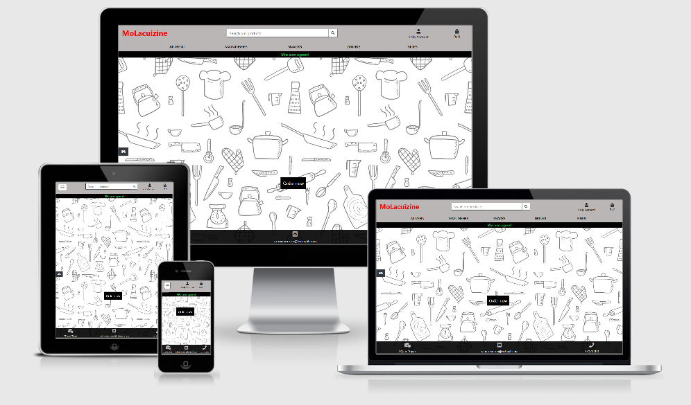
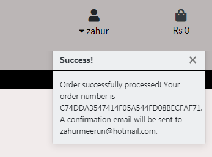
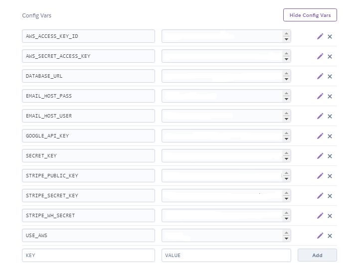

# **MoLacuizine**



## TABLE OF CONTENT 
* [Introduction](#introduction)    
* [UX](#ux)
    * [UX design work overview](#ux-design-work-overview)
    * [Colour scheme](#colour-scheme)
    * [Typography](#typography)
* [Development cycle](#development-cycle)
* [Features](#features)
    * [Navbar](#navbar)
    * [Town Modals](#town-modal)
    * [search bar](#search-bar) 
    * [Pagination](#pagination) 
    * [Items details](#item-details) 
    * [Bag page](#bag-page) 
    * [Spice index](#spice-index) 
    * [Profile page](#profile-page)
    * [Store status feature](#store-status-feature)
    * [Store management page](#store-management-page)
    * [Item availbility feature](#item-availability-feature)    
    * [Django messages](#django-messages)
    * [Checkout page](#checkout-page)
    * [Delivery time](#delivery-time)
    * [Footer](#footer)
* [Registration and login](#registration-and-login)
* [Technologies used](#technologies-used)
* [Data schema](#data-schema)
    * [Forms used](#forms-used)  
    * [Foreign key](#foreign-key)    
    * [CRUD authorisation and security features](#crud-authorisation-and-security-features)
    * [Checkout user restrictions](#checkout-user-restrictions)      
* [Testing](#testing)
    * [UX testing](#ux-testing)
    * [validators](#validators)
    * [Django unittest](#django-unittest)
    * [Chrome DevTools](#chrome-devtools)    
    * [Site testing](#site-testing)
    * [Responsive design](#responsive-design)
    * [Browser compatibility](#browser-compatibility)
    * [Button and link testing](#button-and-link-testing) 
    * [CRUD operation testing](#crud-operation-testing)
    * [Form validation](#form-validation)
    * [Stripe operation testing](#stripe-operation-testing)      
    * [Issues encountered during development](#issues-encountered-during-development)

* [Deployment](#deployment)
* [Future improvements](#future-improvements)
* [Credits](#credits)

## INTRODUCTION 

This project is a online food ordering and delivery service site. The site name 'MoLacuizine' is mauritian for 'My Kitchen'.
The menu covers a wide range of popular mauritian cuisine whereby a customer can add food items to a basket and then make payments 
online using stripe service.

The site would also permit the user to add and modify profile information to be used at checkout and also to have a list
order history for reference. 

The site uses the Django framework.

The live site can be found [here](http://mo-lacuizine.herokuapp.com/).

## UX 

By visiting this site as a user I want to:
* have a user friendly registration/login process in order to use the site.
* be provided with details of each product.
* be able to narrow down items list so as to show items that meet my requirements.
* be able to add items to a basket so I can view all items I have selected together with the associated cost.
* be able to modify items added to my basket so as to make any required changes.
* be able to add and update my user profile so to make any changes if required.
* have a user friendly checkout process.
* be provided with estimated delivery time for ordered items to be able to know when I expect my food items to arrive.
* be provided with a list of previously ordered items for me to track my order history.
* be advised that checkout was successful to ensure order was processed.
* be informed of the online open/close status for ordering.

By using this site as the site owner:

* be able to add, update and delete items for store management purposes.
* be able to toggle the online status of the store for control purposes.
* be able to make an item become temporarily unavailable. 
* be able control access to the store management page and features.

### UX design work overview

The following provides an overview of the site layout and logic behind design choices.

A wireframe was constructed using balsamique wireframes. It can be found [here](static/doc/wireframe.pdf).

The site consisted of a main landing page which contained a fixed top navbar from which the user could access 
food items categories,accounts and basket. This was done so as to give a general overview to the user before showing any items.
The main landing page would also show the main information about the site such open-status and delivery zones.

The site implemented several features to make registration, login, checkout, adding items and profiles as user friendly and 
intuitive as possible which are described below. 

The django messages system was included so as to enable the user obtain feedback on whether actions had been completed.

A search bar was then provided in the top navbar for conveienience to provide an easy way for searching for items.

The items product page provided an overview of the item which could be purchased with the main information on the product. 
Each item could be clicked on to provide further detail on the product. This was done to make the product listing page less bulky 
and more user friendly.

From the product detail page items could be added to a basket to be viewed later.

The bag view consisted of a convenient place to view all items added to basket with their associated cost. Items could be 
modified if required in this view.

The profile page consisted of a form which the user could prefill which could be used at checkout so as to enable a 
smoother checkout process.

The store management page allowed a convenient place to upload items and update shop online status.

All features are described in detail [below](#features).

### Colour Scheme 

Several colour schemes were tested and the following palette was finally adopted since it was thought to fit into the overall site theme.


All button were also designed to have an identical colour scheme for easy identification.

### Typography

Font were obtained from [google font](https://fonts.google.com/) and consisted of the following:
- 'Lato'

## DEVELOPMENT CYCLE

The main development cycle is listed below:

1. Site design work making use of sketch pad and balsamique.
2. Database design.
3. Alluath initial setup.
4. Home app creation and coding (main landing page).
5. Product app coding (item listing pages including item details, search bar).
6. Bag app creatoin and coding (bag page).
7. Coding add to bag view.
8. Coding of context.py (bag contents).
9. Coding of bag view.
10. Coding of edit and update bag features.
11. Pagination coding of item listing page.
12. Profile app creation and coding (profile page).
13. Checkout app reation and coding(checkout page without stripe).
14. Coding for updating of profile page details.
15. Coding for adding order history to profile page.
16. Coding for store management page (adding/updating/deleteing products).
17. Store status coding.
16. Deployment to heroku.
17. Coding for stripe checkout.
18. Coding for google distance matrix.
19. Project review.
20. Minor modifications addressed from step 19.
21. Addition of spice index to site with neccessary updating of installed apps.
22. Unit testing
23. Addition of item availability feature.
24. Final project review.
25. Final adjustments.

## FEATURES

This section gives details of the features included and their function.

### Navbar

The navbar was contructed using bootsrap and and made to be collapsable on medium devices and smaller.

The navbar consisted of 3 levels. The top levels contained logo, search bar, Account login and bag/basket features. 
Middle level contained category links and the bottom level the store status.


### Town Modal

A modal to display the towns the delivery service catered for was provided for the user. It was located on the home page 
since the users could would be able to know from the beginning if the delivery service catered for their location. 


### Search bar 

Search bar was included in the site since it would be a helpful tool in too narrow down user requirements with ease. The
search criteria was based on: 
1. item description
2. iten name

These criterion were suitable enough to narrow down the item list significantly. 

### Pagination 

From the project initiation it was decided to include pagination for the item listing pages to improve UX by
preventing large amount of items being listed in one page. 

The amount of items listed per page was defaulted to 8 since this was thought to provide a good balance between 
small and large devices.


### Item details

The items details were displayed on two types of cards. One for the main item page and the other for the item detail
page. This was done so as to not overload the user with details whilst browsing items.

The main difference between the 2 display cards was that the item detail card contained item description and the
'add to bag' link. Both cards contained price and  category.


The 'add to bag' link would permit the user to add the item to the bag with the corresponding quantity and spice index.

### Spice index

Certain dishes which could be prepared to have different levels of spice were given a spice index selector. This would permit
the user to select a spice index according to their preference which and would then be taken into consideration when the menu
was prepared. The levels were mild, medium and hot.


### Bag page

The bag page consisted of an order summary where all the items which were added to bag could be viewed in one convenient place
together with their associated cost.

This page also permitted the user to update and delete items while also updating the total cost.


The bag page could be assesed via a link in the navbar which also showed the total cost (excluding transport). The bag icon 
would be black and disabled if the bag was empty and would change to blue and active otherwise.


### Profile page

A user profile page was included which permitted the user to upload/update information about themselves. This information would be
used during the checkout process, thus providing a smoother checkout experience. The information required was phone number, 
street addres, town and postcode.


The profile page consisted of a form which would allow users to create and edit records in the UserProfile database.

The profile page also provided a list of clickable ordered items for the user to review.

### Store status feature

A store status banner was included in the navbar which would indicate whether ordering could be performed. 


If the case where the store status was set to close coding was added to prevent ordering or checkout being performed.
This was done to allow the site owner control on when orders could be accepted. This feature would be used to change store 
online status for openning and closing purposes and in the event the store required closing.

### Store management page

A Store management page was designed to cater for two features:
1. Adding/updating of items.
2. Toggling of store open/close online status.

This page was solely for the store adminstrator and additional security coding was provided to achieve this requirement.

For adding items a form was provided allowing the uploading of category, item name, description, spice index present, item availability,
price and image.

The same form would be used to update the item if modifications were required but with all prefilled information which also
included the original item image. 


As for store status, a button was added which would toggle store status from online to offline. The offline status would disable
the checkout process and add to bag operation only.


### Item availability feature

The item availablity feature was included in the add product page. This feature would permit the administrator to quickly 
remove items temporarily from the user view only without removing the item completely. Such an option was thought to
be ideal in the instance if a specific dish was missing a prepartion ingredient and would not be able to be ordered at that
specific time.

The item would then be tagged as available or unavailable for the administator only.


### Django messages

The django messages framework was used to provide temporary messages to indicate whether actions have been completed or not.
This was done using django message levels info, success and error.

This was used specifically for:
1. Login and registration
2. Adding/Updating of products
3. Adding/updating of profiles information
4. Adding/updating/deleting products from bag
5. Store status update
6. Checkout process



### Checkout page

The checkout page consisted of a form which would be prefilled with user profile information and a section for order summary. 
This page would permit the user to add credit card details and make payment online using the stripe payment sytem. 

The town field consisted of a list of available delivery towns. A text request field was also added to permit the user  to add
any special request which they might have.


### Delivery time

A delivery time featuture was also included making use of google distance matrix API. 

Requests were made making use of the user's selected town coordinates referenced to the home base coordinates. The Home
base chosen was vacoas.

The calculation used was: 30 mins preparations time + google matrix delivery time rounded up to the nearest 5 mins.


### footer

A basic footer was provided with openning times and conatct info.

## REGISTRATION AND LOGIN

During project conception it was decided not to allow anonymous checkout and thus sign-up would be required. The reasoning 
behind this was to gather maximum information on user order preferences. This information could be used as a marketing tool 
to pick-up user trends which could then be used to send out customised promotional emails which in the long run could be more profitable
than having anonymous checkout. 

Also, anonymous users would still have to fill in the checkout form which contained most of the details for registration hence making
registration less of an issue.

The django allauth module was used for registration and login purposes.

## TECHNOLOGIES USED

* HTML5
* css 
* javacript (ES6)
* python (v3.8.6)
* Django framework
* SQL database
* Amazon web servives for production storage of static and images files
* Jquery to simplify DOM manipulation
* pylint, flake8 PEP8 compliance
* official W3C validator to check HTML syntax
* css official validator(jigsaw) to check css syntax
* JSHint to check javacript syntax 
* Chrome developers tools for analysing scripts and debugging
* Boostrap 4 for :
    1. page layout purposes and responsive design aspects
    2. Forms 
    3. Modals    
    4. Navbar
    5. Footer
* balsamiq wireframes application to create the site design
* Chrome extension 'responsive viewer' to aid in responsive design 

## Data schema 

SQLite was used for storing data local storage and PostgreSQL for production.

Models were created in django by defining the fields and behaviour of the data. These models would map to the above
databases.

The following table gives the model used:
 
| Models        |   Fields                                                                       |  Function               |
|:--------------|:-------------------------------------------------------------------------------|:------------------------|
|User           |  Username, firstname, lastname, password, email                                |  sign-in/registration   |
|Store          |  Store Status                                                                  |  Store open/close Status|
|Order          |  Ordernumber, userprofile, fullname, email, phone-number, street address, town,|  Storing Orders         |
|               |  postcode, request, date, delivery-cost, grand-total cost, original-bag, pid   |                         |
|OrderLineItems |  order, product, quantity, spice-index, lineitemtotal                          |  Storing Orders         |
|Town           |  name, long coord, lat coord                                                   |  Delivery               |         
|Userprofile    |  user, default_phone_number, default_street_address, default_post_code, town   |  Checkout process       |
|category       |  name, friendly_name                                                           |  Ordering               |
|Product        |  category, name, decription, spice_index, availability, price, image           |  Ordering               |

The User model made use Django-allauth package so as to reduce software development. Some customisation was 
provided so as allow users to add their first and last name during sign-up. Customisation was achived by literature
obtained from [here](https://dev.to/gajesh/the-complete-django-allauth-guide-la3).

Signal were also used to permit the creation of a Userprofile model once the user had registered.

The store model permitted the saving of the store online status which would could be changed accordingly.

### Forms used

Forms were available for the following models:
1. Order
2. UserProfile
3. Product

The forms provided a convenient means for the user to apply CRUD operations to the relevant database as described 
[below](#crud-operations). All forms required validation and were tested [below](#form-validation).

### Foreign key

Foreign keys were created for databases which were relationships were required, thus permitting querying objects
related to another model. Hence justifying the need for a relational database.

The foreign keys were set-up as follows:

| Foreign Key   |  Models                     |  Location               |
|:--------------|:----------------------------|:------------------------|
|user_profile   |  Order, Userprofile         |  Order                  |
|order          |  Order, OrderLineItem       |  OrderLineItem          |
|category       |  Category, Product          |  Product                |
|user           |  User, UserProfile          |  UserProfile            |
|town           |  Town, UserProfile          |  UserProfile            |

An example of the use of foreign key was one could obtain all orders for a specific user profile through a query as 
such:  ```orders = profile.orders.all()```.

### CRUD operations

CRUD operations from the site interface were provided as follows:

| Feature             |   Create   |   Read    |  Update   |  Delete  |  Models             | 
|:--------------------|:-----------|:----------|:----------|:---------|:--------------------|
|User registration    |  &#9745;   |           |  &#9745;  |          | User                |     
|User login           |            |  &#9745;  |  &#9745; *|          | User                |
|Bag                  |  &#9745;   |  &#9745;  |  &#9745;  | &#9745;  | bag.session         |             
|Profile              |  &#9745;   |  &#9745;  |  &#9745;  | &#9745;  | UserProfile         |            
|Products             |  &#9745;   |  &#9745;  |  &#9745;  | &#9745;  | products            |
|Store status         |            |  &#9745;  |  &#9745;  |          | Store Status        |
*password update

Full CRUD operations where provided for all models from the admin page interface.

### CRUD authorisation and security features

A user would be able to have access to only their profile page and thus could only update their own profile. This was achived using the 
django login decorator. 

A user would be able to apply CRUD operations to items stored in their bag sessions only.

The store management page could only be accessed by the administrator by usng the django login decorator. A redirect
was also included to prevent url manipulation by a user if the user was not an administator thus preventing illegal
access to the store management page. This would prevent CRUD operations on products and changing of store status. 

Redirects were also applied in the case site users tried to manipulate urls to delete or update products or if a user 
tried to manipulate url to access the checkout page if store status was closed.

### Checkout user restrictions

As anonymous checkout was not allowed users would be required to sign-in for purchases. Therefore, if a user had not signed 
in and the checkout page was clicked on a redirect would trigger leading to the sign-up page. This redirect was for
anonymous users only. 

## TESTING 

This section provides details of testing performed during development. The following table highlights the different stages when testing were carried out:

| Test                | Stage Performed                                  | Tool used                                     |
|---------------------|:-------------------------------------------------|:----------------------------------------------|
|Syntax errors        |Once During mid development and on completion     |W3C validator, css validator(jigsaw), jshint   |
|Debugging            |During the whole project                          |Chrome Devtools, Flake8                        |
|Unitest              |project completion                                |django TestCase                                |
|Responsive design    |During the whole project                          |Python code                                    |
|Site testing         |As from when views were completed                 |By myself and relatives                        |
|Browser compatibility|On project completion                             |Manual testing on browsers                     |                    
|Button/link testing  |During development and project completion         |Manual testing                                 |

### UX testing

The goals set out in the UX section were accomplished as follows:

1. User goal: *have a user friendly registration/login process in order to use the site*<br>
This was achieved using the django allauth application which allowed a tried and tested login and registration process.

2. User goal: *be provided with full details of each product.*</br>
This was achieved using the product details card which provided all relevant details on the item for the user.

3. User goal: *be able to narrow down items list so as to show items that meet my requirements.*</br>
This was achieved by using both search bar and category search links.    

5. User goal: *be able to add items to a basket so I can view all items I have selected together with the associated cost.*</br>
This was achieved with the bag view [page](#bag-page) described above.

5. User goal: *be able to add and update my user profile so to make any changes if required.*</br>
This was achieved with the profile user page.

6. User goal: *have a user friendly checkout process.*</br>
This was achieved by using the checkout page.

7. User goal: *be provided with estimated delivery time for ordered items to be able to know when I expect my food items to arrive*</br>
This was achieved by using the google distance matrix described [above](#delivery-time).

8. User goal: *be provided with a list of previously ordered items for me to track my order history.*</br>
This was achieved using order history page providing a list of all ordered items for that user.

9. User goal: *be advised that checkout was successful to ensure order was processed*</br>
This was achieved with the checkout success page.

10. User goal: *be informed of the online open/close status for ordering*</br>
This was achieved with the store status desribed [above](#store-status-feature).

11. Site administrator goal: *be able to add, update and delete items for store management purposes.*</br>
This was achieved with the store management [page](#store-management-page).

12. Site administrator goal: *be able to toggle the online status of the store for control purposes.*</br>
This was achieved with store status [feature](#store-status-feature).

13. Site administrator goal: *be able to make an item become temporarily unavailable.*</br>
This was achieved with item availability [feature](#item-availability-feature).

14. Site administrator goal: *be able control access to the store management page and features.*</br>
This was achieved with by providing coding to prevent illegal access as described [here](#crud-authorisation-and-security-features).

The above user goals were further tested by obtaining feedback from an artist. The feedback was positive all on aspects.

### Validators

Code syntax were checked for errors with the following validators:
* official W3C validator located [here](https://validator.w3.org/)
* css official validator(jigsaw) located [here](https://jigsaw.w3.org/css-validator/)
* JSHint located [here](https://jshint.com/)
* Pylint, flake8, PEP8 for python code validation

Errors were corrected and final test results are given below:

| Test                                 | Expected result                | Results            |                                 
|:-------------------------------------|:-------------------------------|:-------------------|
|W3C HTML validator                    |No errors or warnings to show   |Errors present      | 
|css official validator(jigsaw)        |No errors found                 |Passed              |                            
|JSHint located                        |Congratulations. No error found |Warnings present    |
|Python validator(pylint, Flake8, PEP8)|No errors                       |Errors present      |

For the W3C HTML validator all errors were due to django template language which raised a ```bad value``` error. These errors
were filtered out.

The error 'Doctype must be declared first' was also ignored and was due to the use of base.html template.

The Jshint test results had the warning " 'let' is available in ES6 (use 'esversion: 6') or Mozilla JS extensions (use moz)." was due to
syntax used for defining variables.

### Django unittest

Django unittest was performed on all apps created by myself to check for bugs and inconsistencies in python code. The testing covered the
views, models and forms for each app.

The coverage is summarised below:

| app           | Coverage (%)     |                                
|:--------------|:-----------------|
| bag           |99                |
| checkout      |80                | 
| home          |87                |                         
| products      |99                | 
| profile       |98                |                          


### Chrome DevTools

Chrome DevTools were used extensively during development phase to assist in:
* page layout issues 
* checking errors
* debugging
* verifying correct output using console  

### Site testing

The site was tested by myself and once the main site was completed it was further tested by having relatives use the site.
The feedback obtained was positive.

### Responsive design

The site was viewed on different device sizes to check for correct responsive design. This was done using primarily
Chrome DevTools with different emulated devices(moto G4, iphone 6/7/8, ipad, ipad pro). The responsive viewer chrome 
extension was also used. Resolutions covered are as follows:

|Screen resolution| Device                        |
|:----------------|:------------------------------|
|1280 X 800       |large screen                   |
|1024 X 800       |medium screen                  |
|768 X 1024       |ipad                           |
|414 X 736        |iPhone 8 Plus, 7 Plus, 6S Plus |
|375 X 667        |iPhone 8, 7, 6S, 6             |
|414 X 896        |iPhone XR, XS Max              |
|375 X 812        |iPhone XS, X                   |
|412 X 846        |Galaxy S9 Plus, S8 Plus        |
|360 X 740        |Galaxy S9, Note 8, S8          |
|323 X 786        |Pixel 3, 3 XL                  |


### Browser compatibility

The site was tested on Google Chrome, FireFox, Internet Explorer, Safari and Opera. Issues are discussed [below](#issues-encountered-during-development)

### Button and link testing

The following gives test results for button and link testing not related to CRUD operations and stripe checkout process.

| location            |links/button                   |Expected result                                                | Results |                                 
|:--------------------|:------------------------------|:--------------------------------------------------------------|:--------|
|Navbar               | logo                          |Redirect to home page                                          |Passed   |
|Navbar               | Search bar                    |Produce list of related search items                           |Passed   |
|Navbar               | My Account                    |Dropdown menu to appear                                        |Passed   |
|Navbar               | Login                         |Redirect to login page                                         |Passed   |
|Navbar               | Register                      |Redirect to registration page                                  |Passed   |
|Navbar               | Logout                        |Redirect to logout page                                        |Passed   |
|Navbar               | Store management              |Redirect to Store management page                              |Passed   |
|Navbar               | profile                       |Redirect to profile page                                       |Passed   |
|Navbar               | Bag icon(bag empty)           |Link inactive                                                  |Passed   |
|Navbar               | Bag icon(bag with item)       |Redirect to bag page                                           |Passed   |
|Navbar               | All Menu                      |Redirect to page listing all items                             |Passed   | 
|Navbar               | Main Dishes                   |Redirect to page listing all main dishes                       |Passed   | 
|Navbar               | Snacks                        |Redirect to page listing all snacks                            |Passed   | 
|Navbar               | Drinks                        |Redirect to page listing all main drinks                       |Passed   | 
|Navbar               | Sides                         |Redirectto page listing all sides                              |Passed   | 
|Navbar               | Burger icon                   |collapsable menu to activate                                   |Passed   | 
|Home page            | Motorcycle icon               |Town we deliver to modal to open                               |Passed   | 
|Town modal           | close                         |Town we deliver to modal to close                              |Passed   | 
|Home page            | Order now                     |Direct to page listing all menu                                |Passed   | 
|Footer               | email icon                    |Click to email to activate                                     |Passed   | 
|Footer               | phone icon                    |Click to phone to activate                                     |Passed   | 
|Item pages           | click on item                 |Redirect to item detail page                                   |Passed   | 
|Item pages           | Cutlery icon                  |Redirect to page listing that item                             |Passed   | 
|Item pages           | pagination numbers            |Redirect to clicked page                                       |Passed   | 
|Item pages           | pagination arrows             |Redirect to next or previous page                              |Passed   |
|Item pages           | pagination (first page)       |left arrow to disactivate                                      |Passed   |
|Item pages           | pagination (last page)        |Right arrow to disactivate                                     |Passed   |
|Login page           | sign in (correct sign in data)|Direct to home page with success message                       |Passed   |
|Login page           | sign in (incorrect login data)|Error message to display                                       |Passed   |
|Login page           | sign up                       |Redirect to sign page                                          |Passed   |
|Login page           | Forgot password               |Redirect to password reset page                                |Passed   |
|Reset password page  | Reset my password             |Redirect to reset password page                                |Passed   |
|Sign-up page         | sign-up (invalid form)        |Prompt with relevant warning                                   |Passed   |
|Sign-up page         | sign-up (valid form)          |Redirect to login page with email notification  for validation |Passed   |
|Sign-up page         | sign-in                       |Redirect to sign in page                                       |Passed   |
|Profile page         | change password               |Redirect to change password page                               |Passed   |
|profile page         | order history                 |Redirect to clicked order history                              |Passed   |
|Change password page | change                        |Redirect to user profile page with success message             |Passed   |
|Order history page   | My profile                    |Redirect to user profile                                       |Passed   |
|Order history page   | My profile                    |Redirect to user profile                                       |Passed   |
|Product detail page  | Continue ordering             |Redirect to all menu page                                      |Passed   |
|Bag page (with items)| Continue ordering             |Redirect to all menu page                                      |Passed   |
|Bag page (empty)     | Fill you bag                  |Redirect to all menu page                                      |Passed   |
|Bag page             | secure checkout               |Redirect to checkout page                                      |Passed   |
|checkout page        | edit order                    |Redirect to bag page                                           |Passed   |
|Item listing page    | update                        |Redirect to store management page                              |Passed   |

### CRUD operation testing

The following summarises the CRUD operations from the site interface except for STRIPE checkout process:

|Model      |Action                      |Expected result                                              |Results  | Message      |                                 
|:----------|:---------------------------|:------------------------------------------------------------|:--------|:-------------|
|Profile    |Modify phone number         |user phone number to be updated in database                  |Passed   |    &#9745;   | 
|Profile    |Modify street address       |Street address to be updated in database                     |Passed   |    &#9745;   |
|Profile    |Modify town                 |Town to be updated in database                               |Passed   |    &#9745;   |
|Profile    |Modify postcode             |Postcode to be updated in database                           |Passed   |    &#9745;   |
|Profile    |Remove phone number         |user phone number to be deleted in database                  |Passed   |    &#9745;   | 
|Profile    |Remove street address       |Street address to be deleted in database                     |Passed   |    &#9745;   |
|Profile    |Remove town                 |Town to be deleted in database                               |Passed   |    &#9745;   |
|Profile    |Remove postcode             |Postcode to be deleted in database                           |Passed   |    &#9745;   |
|Store      |Modify open status          |store status to be updated to close in database              |Passed   |    &#9745;   |
|Store      |Modify open close           |store status to be updated to open in database               |Passed   |    &#9745;   |
|Product    |Add product                 |Product added to database                                    |Passed   |    &#9745;   |
|product    |Modify product fields       |Modified field updated in database                           |Passed   |    &#9745;   |
|product    |Delete product              |Product deleted in database                                  |Passed   |    &#9745;   |
|n/a        |add item                    |item added to bag                                            |Passed   |    &#9745;   |
|n/a        |update item quantity in bag |item quantity updated in bag                                 |Passed   |    &#9745;   |
|n/a        |delete item from bag        |item deleted from bag                                        |Passed   |    &#9745;   |

Full CRUD operations were available from the admin interface.

The following summarises the CRUD operations from the admin inteface for categories and town:

|Model      |Action                      |Expected result                        |Results  |                                 
|:----------|:---------------------------|:--------------------------------------|:--------|
|Category   |Create category             |category added to database             |Passed   |    
|Category   |Modify category fields      |Modified field updated in database     |Passed   |   
|Category   |Delete category             |category deleted in database           |Passed   |   
|Town       |Create town                 |Town added to database                 |Passed   |   
|Town       |Delete town                 |town deleted in database               |Passed   | 

### Form validation

Two types of form validation existed. One would pick up errors in the frontend such as missing required fields
and the other backend. The backend would check if form was valid before applying CRUD operations to the database. If for any
reason errors were detected this would raise an error.

The add/update product form were tested as follows:

|Action                            |Expected error message               |Results |                                 
|:---------------------------------|:------------------------------------|:-------|
| missing required field           |'please fill out this field' prompt' | Passed |

The above condition didnt not apply to the profile page since none of the fields were required. Testing was performed only
on the incorrect number format as follows: 

|Action                            |Expected error message                                                          |Results |                                 
|:---------------------------------|:-------------------------------------------------------------------------------|:-------|
| Incorrect phone number           |'Error: Incorrect number format. Update failed. Please ensure the form is valid.| Passed |

Hence, the above test was proof that the backend form validation was operational.

### Stripe operation testing

The stripe process was linked to the order model since orders would only be created if the stripe payement process
was successful. Therefore testing was peformed also on the stripe process as detailed below.

Stripe webhook testing was performed by:
1. Creating test activity on account
2. Manually sending test events from dashboard

The above two testing methods were in-line with the stripe [documentation](https://stripe.com/docs/webhooks/test)

Results are given below:

|Action                         |Expected webhook result                   | Status     |Results  |                                 
|:------------------------------|:-----------------------------------------|:-----------|:--------|
|Send test webhook              |Test webhook sent successfully            |   200      |Passed   |    
|Direct to checkout page        |payment_intent.created                    |   200      |Passed   |
|Complete order(send to kitchen)|payment_intent.succeeded                  |   200      |Passed   |  
|                               |charge.succeeded                          |   200      |Passed   |  

After successful stripe operation, orders would be created in relevant database with a feedback success message and 
a redirect to the checkout success page. 
Results are given below:

|Model        |Action                         |Expected result                      |Results  | Message     |                                 
|:------------|:------------------------------|:------------------------------------|:--------|:------------|
|Order        |Complete order(send to kitchen)|Order created in database            |Passed   |   &#9745;   | 
|OrderLineItem|Complete order(send to kitchen)|OrderLineItem  created in database   |Passed   |   &#9745;   |
|n/a          |Complete order(send to kitchen)|Email sent to email in order form    |Passed   |   &#9745;   |

 

Once the 'send to kitchen' button was pressed stripe would verify card details before processing order, during this
this period the submit button was deactivated temporarily. After successful payment the submit button would be reactivated
and the order would be created in database as tested above via the checkout view. If for any reason the card checking 
process was successful and submit button could not be activated the order would be created via the webhook handler view. 
This would cater for the event that a customer had made a successful payment and submit button was not activated. 

Below details tests performed to verify that this process was successful. To simulate the condition where the submit button 
was deactivated the page was closed after pressing the send to kitchen button.

|Action                                                        |Expected recieved webhook received          | Status |Results  |                                 
|:-------------------------------------------------------------|:-------------------------------------------|:-------|:--------|
|Complete order(send to kitchen) with activated submit button  |SUCCESS: Verified order already in database |   200  |Passed   |  
|Complete order(send to kitchen) with deactivated submit button|SUCCESS: Created order in webhook           |   200  |Passed   |  

 

In both cases orders were verified to have been created in the Order and orderInLine model.

Possible errors were also tested in the checkout process. Any errors would be highlighted to the user via a message which was part
of the feedback system:

|Action                                                  |Expected error message               |Results |                                 
|:-------------------------------------------------------|:------------------------------------|:-------|
|Complete order(send to kitchen) missing required field  |'please fill out this field' prompt' | Passed |  
|Complete order(send to kitchen) invalid card info       |'Your card number is invalid.'       | Passed |
|Complete order(send to kitchen) using card decline code*|'Your card was declined.'            | Passed | 
*card number:4000 0000 0000 0002  

 

### Issues Encountered during development

During testing phase the following issues were identified and corrected.

1. Pagination was included in the items listing page. This was initially planned to be coded in the ```all_products```
view. After completing this function the pagination would not work with the search bar or category search feature. The search
criteria would be dropped when selecting another page. The solution adopted was to create seperate views for search bar and 
category search.

2. Whilst scrolling the items page the active pagination number link would hide the navbar. To prevent this issue the active z-index index was set to 0.

    

3. Initially at registration the user would only need to input email, password and username. After mid project review it 
was decided to include firstname and lastname in the sign-up process since anonymous ordering was not permitted and these
inputs would be required. Attempts to modify the sign-up form were tried and unsuccessfully and research was performed. The 
solution was obtained from the this [link](#https://dev.to/gajesh/the-complete-django-allauth-guide-la3).

4. When forms fields consisted of a dropdown field, such as category and towns, the placeholder would not reflect that
field. It would be dashed lines.

    
Inorder to resolve this issue javacript was used to make the first child equal to that field with the following coding:
  
    ```$('#id_category option:first-child').html('Category');```  

5. On the store management page the upload button was default button for uploading images. This was thought not to fit 
into the overall site deisgn. To overcome this issue the default button was set to hidden using javacript and another button 
was introduced which when clicked on would activate the hidden upload button. 
    
    ```$('#id_image').hide()```  
    ```$('#upload-button').click(function(){```
    ```$('#id_image').click()``` 
    ```})```

6. One of the features introduced was the store status which permitted opening and closing of the store online status.
The toggling of store status was originally planned to be a form situated on the store management page. However after
initial coding the form would not work since the store management page already had a form for adding and removing products
thus not allowing a second form. To overcome this problem, and still have the store status feature on the store management
page, javacript was used instead of a form. When the open/close button was pressed information was sent to the store status
view using javacript which would subsequently update the store status model. 

7. After initial deployment to heroku was performed the site would not run. After research one of the issues was thought to 
not having data in the category and product database. To fix this issue fixtures were created using ```python manage.py dumpdata```
and then loaded into the PostgreSQL database. This corrected the issue.

8. Initially when unittest were performed a 404 error would occur for all tests eventhough the site worked normally.
After several attempts to find the problem the issue was found. For the unittest to work properly the store status was required to be set to 'open' 
in the test setup. Once this was done all tests worked normally.
 
9. When a item was set to unavailable it still could be added to bag by manipulating the url. To prevent this issue 
additonal coding was introduced which would action a redirect if an unavailable item was added to a bag followed by a relevant 
error message.

10. For browser compatibility, only Internet Explorer caused several issues. The issues were incorrect font colour, font sizes,
missing backgrounds and quantity increment/decrement buttons not working.  

    

The site still worked on Internet Explorer but the overall UX was less than that of other browsers. Due to Internet Explorer 
no longer being supported bugs were left as such.

11. During form testing it was noticed that incorrect phone format could be applied to the UserProfile phone number field without raising an 
error. Research was peformed and django [RegexValidators](#https://docs.djangoproject.com/en/3.1/ref/validators/#regexvalidator)
were used. This permitted the use of regex for correct number formatting while raising an error which could be displayed to the user.

# DEPLOYMENT

Gitpod was used as an online IDE and then pushed to GITHUB. The Github account was then linked to 
heroku for [hosting](http://mo-lacuizine.herokuapp.com/).

To deploy the project from Heroku the following steps were used:

1. Login to heroku and create the mo lacuizine repository by clicking on create new app.

    

2. Provision a PostgreSQL database for the new app from the resource page.

    

3. Install dj-database-url and psycopg2-binary

4. Freeze requirements: ```pip3 freeze --local > requiremenets.txt``` and ensure Procfile has been created.

5. Run migrations to the new PostgreSQL database from the gitpod CLI by adding the new database to django settings
as such:

    ```DATABASES = {'default': dj_database_url.parse(os.environ.get('postgres://******************************'))}```    

6. Make fixtures for categories and products using the ```dumpdata`` command.

7. Load data into new database using the ```loaddata``` command.

8. Create a new Superuser using the command: ```python3 manage.py createsuperuser```

9. Go to settings and set all confing vars in Heroku including DISABLE_COLLECTSTATIC=1.
Static files will be used from Amazon web service.

    

10. Add host name of heroku site to allowed host in settings:
```ALLOWED_HOSTS = ['mo-lacuizine.herokuapp.com', 'localhost']```

11. Go to Deploy section in Heroku from menu bar.

    

12. Scroll down to deployment method and select Github.

    

13. Scroll to connect to github and search and select the required repository.

    

14. Enable automatic deploy. 

    

15. When the command ```git push``` is applied in gitpod this will automatically update heroku.

To run code locally the following steps should be performed:
1. On GitHub, navigate to the main page of the repository.
2. Above the list of files, click  Code and copy URL.

    

3. Open Git Bash.
4. Change the current working directory to the location where you want the cloned directory.
5. Type git clone, and then paste the URL you copied earlier.</br>
    ```$ git clone https://github.com/zahur76/molacuizine```
6. Press Enter to create your local clone.

## FUTURE IMPROVEMENTS

1. Pagination would need to be added to the order history on the profile page.
2. Add a feature which would add the orders to the kitchen once checkout was complete and list the ingredients required. 
Once the order had been prepared the order could be ticked off as being ready for delivery.
3. Include an app which would be used for the delivery service. The app would be able to show delivery status
and update the order delivery status. 
4. For delivery, instead of having a list of towns for the user to choose from, the user could select their location using 
google map. Their location could then be used by the delivery service for more accurate delivery time and location.
5. Provide a loyalty program for users which would offer discount to users.

## CREDITS

### Content

* [Geek for geeks](https://www.geeksforgeeks.org) for providing resource on how to create unique filenames.
* [Stack Overflow](https://stackoverflow.com/questions/34248898/how-to-validate-select-option-for-a-materialize-dropdown ) on how to validate drop down menus.
* [W3 Schools](https://www.w3schools.com/howto/howto_css_smooth_scroll.asp#section2 ) on how to make scroll behaviour smooth.

### Media

* All Icons were obtained from [font awesome](https://www.fontawesome.com).
* All images obtained from [Unsplash](https://unsplash.com/).

### Acknowledgment

* I would like to thank Samia Mallam-Hasham for testing the site and Allen Thomas Varghese for his input during 
the mentor sessions.
